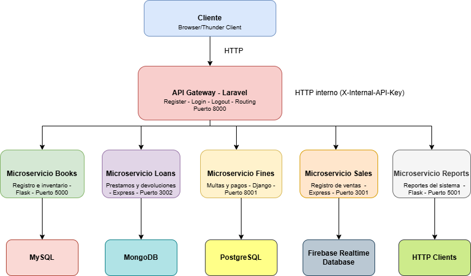

# 📖 Sistema de Biblioteca - Arquitectura de Microservicios

## Descripción General

Sistema de gestión de biblioteca basado en arquitectura de microservicios que permite administrar el catálogo de libros, préstamos, multas, compras e y reportes de libros adquiridos. Desarrollado como proyecto individual para la asignatura de Ingeniería de Software II.

## Arquitectura del Sistema

El sistema está compuesto por un API Gateway y 5 microservicios independientes que se comunican entre sí mediante APIs REST.

### Componentes

- **API Gateway** (Laravel + MySQL): Punto de entrada único, gestión de autenticación y enrutamiento
- **Microservicio de Libros** (Flask + MySQL): Catálogo y disponibilidad de libros
- **Microservicio de Préstamos** (Express + MongoDB): Gestión de préstamos y devoluciones
- **Microservicio de Multas** (Django + PostgreSQL): Cálculo y gestión de multas por atrasos
- **Microservicio de Compras** (Express + Firebase): Registro de adquisiciones al proveedor
- **Microservicio de Reportes** (Flask + MongoDB): Genera múltiples reportes del funcionamiento del sistema

### Diagrama de Arquitectura



---
 
## 📁 Estructura del repositorio
 
```
Biblioteca-Digital/
├── api-gateway/                  # Laravel — Auth + Gateway
│   ├── app/Http/Controllers/
│   │   ├── GatewayController.php # Proxy hacia microservicios
│   │   └── UserController.php    # Registro, login, logout
│   └── routes/api.php            # Definición de rutas
│
└── microservices/
    ├── books/                    # Flask + MySQL
    ├── loans/                    # Node.js + MongoDB
    ├── fines/fines_service/      # Django + PostgreSQL
    ├── sales/                    # Node.js + Firebase
    └── reports/                  # Flask (agrega REST)
```
 
---

## Stack Tecnológico

### Frameworks
- Laravel 10.x
- Django 5.0
- Flask 3.0
- Express 4.x

### Bases de Datos
- MySQL 8.0
- PostgreSQL 15
- MongoDB 7.0
- Firebase Realtime Database

### Herramientas
- Git & GitHub
- Thunder Client (pruebas de API)

> También necesitas una cuenta de **Firebase** con una Realtime Database creada y un `serviceAccountKey.json` descargado para el servicio Sales.

## 🔐 Clave interna compartida (`INTERNAL_API_KEY`)
 
Todos los microservicios validan el header `X-Internal-API-Key` para aceptar únicamente peticiones provenientes del API Gateway. Esta clave debe ser **la misma en todos los servicios**.
 
Puedes usar cualquier string seguro. Ejemplo:
 
```
INTERNAL_API_KEY=mi_clave_super_secreta_2024
```
 
> ⚠️ Define esta clave antes de arrancar cualquier servicio. Si no coincide entre servicios, todas las peticiones internas retornarán `401 Unauthorized`.
 
---

## 🚀 Guía de despliegue inicial
 
Sigue el orden indicado: las bases de datos deben estar listas antes de arrancar los servicios, y los microservicios deben estar corriendo antes de iniciar el API Gateway.
 
---
 
### Paso 1 — Clonar el repositorio
 
```bash
git clone https://github.com/Fullgaito/Biblioteca-Digital.git
cd Biblioteca-Digital
```
 
---
 
### Paso 2 — Crear las bases de datos en Laragon
 
#### MySQL (para Books y API Gateway)
 
```sql
CREATE DATABASE books_db CHARACTER SET utf8mb4 COLLATE utf8mb4_unicode_ci;
CREATE DATABASE laravel CHARACTER SET utf8mb4 COLLATE utf8mb4_unicode_ci;
```
 
#### PostgreSQL (para Fines)
 
```bash
psql -U postgres
CREATE DATABASE fines_db;
\q
```
 
#### MongoDB (para Loans)
 
MongoDB crea la base de datos automáticamente al primer uso. Solo asegúrate de que el servidor esté corriendo:
 
```bash
# Linux/macOS
sudo systemctl start mongod
 
# Windows
net start MongoDB
```
 
#### Firebase (para Sales)
 
1. Ve a [Firebase Console](https://console.firebase.google.com/) y crea o selecciona un proyecto.
2. Activa **Realtime Database** en modo prueba.
3. Ve a **Configuración del proyecto → Cuentas de servicio → Generar nueva clave privada**.
4. Descarga el archivo JSON y guárdalo en `microservices/sales/serviceAccountKey.json`.
 
---
 
### Paso 3 — Servicio Books (Flask · Puerto 5000)
 
```bash
cd microservices/books
 
# Crear y activar entorno virtual
python -m venv venv
source venv/bin/activate        # Linux/macOS
venv\Scripts\activate           # Windows
 
# Instalar dependencias
pip install -r requirements.txt
```
 
Crear el archivo `.env`:
 
```env
DB_HOST=localhost
DB_PORT=3306
DB_USER=root
DB_PASSWORD=tu_password
DB_NAME=books_db
INTERNAL_API_KEY=mi_clave_super_secreta_2024
```
 
Ejecutar migraciones e iniciar:
 
```bash
flask db upgrade
python app.py
```
 
> El servicio quedará disponible en `http://localhost:5000`
 
---
 
### Paso 4 — Servicio Loans (Node.js · Puerto 3002)
 
```bash
cd microservices/loans
npm install
```
 
Crear el archivo `.env`:
 
```env
PORT=3002
MONGO_URI=mongodb://localhost:27017/loans_db
FLASK_URL=http://localhost:5000
FINES_URL=http://localhost:8001
INTERNAL_API_KEY=mi_clave_super_secreta_2024
```
 
Iniciar el servicio:
 
```bash
node server.js
```
 
> El servicio quedará disponible en `http://localhost:3002`
 
---
 
### Paso 5 — Servicio Fines (Django · Puerto 8001)
 
```bash
cd microservices/fines/fines_service
 
# Crear y activar entorno virtual
python -m venv venv
source venv/bin/activate        # Linux/macOS
venv\Scripts\activate           # Windows
 
# Instalar dependencias
pip install -r ../requirements.txt
```
 
Crear el archivo `.env` dentro de `fines_service/`:
 
```env
DB_NAME=fines_db
DB_USER=postgres
DB_PASSWORD=admin123
DB_HOST=localhost
DB_PORT=5432
INTERNAL_API_KEY=mi_clave_super_secreta_2024
```
 
Ejecutar migraciones e iniciar:
 
```bash
python manage.py migrate
python manage.py runserver 8001
```
 
> El servicio quedará disponible en `http://localhost:8001`
 
---
 
### Paso 6 — Servicio Sales (Node.js · Puerto 3001)
 
```bash
cd microservices/sales
npm install
```
 
Crear el archivo `.env`:
 
```env
PORT=3001
FLASK_URL=http://localhost:5000
FIREBASE_DB_URL=https://<tu-proyecto>-default-rtdb.firebaseio.com/
INTERNAL_API_KEY=mi_clave_super_secreta_2024
```
 
> Asegúrate de que `serviceAccountKey.json` ya está en esta carpeta (ver Paso 2 - Firebase).
 
Iniciar el servicio:
 
```bash
node server.js
```
 
> El servicio quedará disponible en `http://localhost:3001`
 
---
 
### Paso 7 — Servicio Reports (Flask · Puerto 5001)
 
```bash
cd microservices/reports
 
# Crear y activar entorno virtual
python -m venv venv
source venv/bin/activate        # Linux/macOS
venv\Scripts\activate           # Windows
 
pip install -r requirements.txt
```
 
Crear el archivo `.env`:
 
```env
BOOKS_SERVICE_URL=http://localhost:5000
LOANS_SERVICE_URL=http://localhost:3002
FINES_SERVICE_URL=http://localhost:8001
SALES_SERVICE_URL=http://localhost:3001
INTERNAL_API_KEY=mi_clave_super_secreta_2024
```
 
Iniciar el servicio:
 
```bash
python app.py
```
 
> El servicio quedará disponible en `http://localhost:5001`
 
---
 
### Paso 8 — API Gateway (Laravel · Puerto 8000)
 
```bash
cd api-gateway
composer install
npm install && npm run build       # Compilar assets Vite
```
 
Copiar y editar el archivo de entorno:
 
```bash
cp .env.example .env
php artisan key:generate
```
 
Editar `.env` con los siguientes valores clave:
 
```env
APP_NAME="Biblioteca Digital"
APP_ENV=local
APP_DEBUG=true
APP_URL=http://localhost:8000
 
DB_CONNECTION=mysql
DB_HOST=127.0.0.1
DB_PORT=3306
DB_DATABASE=laravel
DB_USERNAME=root
DB_PASSWORD=tu_password
 
# Clave interna compartida con todos los microservicios
INTERNAL_API_KEY=mi_clave_super_secreta_2024
```
 
Configurar las URLs de los microservicios en `config/services.php`:
 
```php
'microservices' => [
    'books'   => env('BOOKS_URL',   'http://localhost:5000'),
    'loans'   => env('LOANS_URL',   'http://localhost:3002'),
    'fines'   => env('FINES_URL',   'http://localhost:8001'),
    'sales'   => env('SALES_URL',   'http://localhost:3001'),
    'reports' => env('REPORTS_URL', 'http://localhost:5001'),
],
```
 
O agregar directamente las variables al `.env`:
 
```env
BOOKS_URL=http://localhost:5000
LOANS_URL=http://localhost:3002
FINES_URL=http://localhost:8001
SALES_URL=http://localhost:3001
REPORTS_URL=http://localhost:5001
```
 
Ejecutar migraciones y arrancar:
 
```bash
php artisan migrate
php artisan serve --port=8000
```
 
> El API Gateway quedará disponible en `http://localhost:8000`
 
---

## ✔️ Verificación del despliegue
 
Una vez todos los servicios estén corriendo, verifica con las siguientes peticiones:
 
#### 1. Registrar un usuario
 
```bash
curl -X POST http://localhost:8000/api/register \
  -H "Content-Type: application/json" \
  -d '{"name":"Test User","email":"test@test.com","password":"12345678","password_confirmation":"12345678","cuestion":"color favorito","answer":"azul"}'
```
 
#### 2. Obtener token
 
```bash
curl -X POST http://localhost:8000/api/login \
  -H "Content-Type: application/json" \
  -d '{"email":"test@test.com","password":"12345678"}'
```
 
#### 3. Verificar catálogo de libros (requiere token)
 
```bash
curl http://localhost:8000/api/books \
  -H "Authorization: Bearer <TOKEN>"
```
 
#### 4. Verificar dashboard de reportes
 
```bash
curl http://localhost:8000/api/reports/dashboard \
  -H "Authorization: Bearer <TOKEN>"
```
 
---
 
## 🗺️ Resumen de puertos
 
| Servicio | Puerto | URL local |
|---|---|---|
| API Gateway | `8000` | `http://localhost:8000` |
| Books | `5000` | `http://localhost:5000` |
| Loans | `3002` | `http://localhost:3002` |
| Fines | `8001` | `http://localhost:8001` |
| Sales | `3001` | `http://localhost:3001` |
| Reports | `5001` | `http://localhost:5001` |
 
---

## 🕵️‍♂️ Pruebas de rendimiento

Se realizó distintas pruebas sobre el sistema en general usando la libreria de Locust proporcionada por Python, realizando pruebas de carga,estrés y de capacidad.

> **Nota**: Documentación completa de las pruebas en [Tests/README.md/](Tests/README.md)

### Pasos para desplegar las pruebas

```bash
cd ../api-gateway
php artisan serve
```

### 2. Ejecuta Locust con GUI
```bash
locust -f locust_laravel.py 
```

### 3. Abre el navegador
Ve a `http://127.0.0.1:8089` y configura:
- **Number of users**: Cantidad de usuarios simultáneos
- **Spawn rate**: Usuarios creados por segundo
- Luego presiona "Start swarming"
 
## 🔑 Autenticación
 
El sistema usa dos capas de autenticación:
 
**Capa externa (clientes → API Gateway):** Laravel Sanctum con tokens Bearer. Los clientes deben incluir el header `Authorization: Bearer <TOKEN>` en todas las peticiones a rutas protegidas.
 
**Capa interna (API Gateway → microservicios):** Cada microservicio valida el header `X-Internal-API-Key`. Solo el Gateway conoce y envía esta clave. Las peticiones que lleguen directamente a los microservicios sin esta clave serán rechazadas con `401 Unauthorized`.

---
 
## 📖 Documentación por servicio
 
Cada microservicio tiene su propio README con detalles de endpoints, modelos de datos y configuración:
 
- [`api-gateway/README.md`](api-gateway/README.md) — Auth, usuarios y rutas del gateway
- [`microservices/books/README.MD`](microservices/books/README.MD) — CRUD de libros
- [`microservices/loans/README.md`](microservices/loans/README.md) — Gestión de préstamos
- [`microservices/fines/README.md`](microservices/fines/README.md) — Gestión de multas
- [`microservices/sales/README.md`](microservices/sales/README.md) — Ventas de libros
- [`microservices/reports/README.md`](microservices/reports/README.md) — Reportes y dashboard
 
---

> **Nota**: Documentación completa de endpoints en [api-gateway/README.md/](api-gateway/README.md)


## Comunicación entre Microservicios

Los microservicios se comunican mediante HTTP/REST:

- **Préstamos → Libros**: Consulta disponibilidad y ajusta stock al crear o devolver préstamos
- **Préstamos → Multas**: Genera multas por devoluciones atrasadas
- **Compras → Libros**: Descuenta stock al registrar ventas
- **Reportes → Préstamos / Multas / Compras**: Agrega reportes consolidados de actividad


## ⚠️ Notas importantes
 
**Orden de arranque:** Los microservicios deben estar corriendo **antes** de iniciar el API Gateway, ya que este realiza llamadas HTTP a ellos en el momento de las peticiones.
 
**Variables de entorno:** Nunca subas archivos `.env` ni `serviceAccountKey.json` al repositorio. Están incluidos en `.gitignore`.
 
**Entornos virtuales Python:** Cada servicio Python (Books, Fines, Reports) tiene su propio `venv`. No compartas entornos entre servicios.
 
**Firebase:** El archivo `serviceAccountKey.json` contiene credenciales de producción. Trátalo como una contraseña.
 

## Autor

**Sergio Alejandro Gaitán Quintero** - Estudiante de Administración de sistemas informáticos - Universidad Nacional de Colombia
