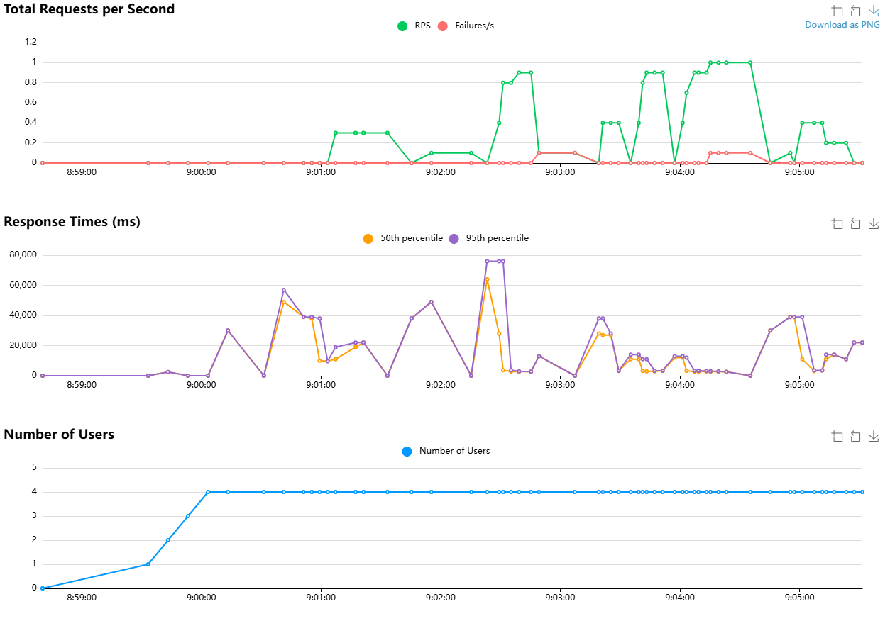
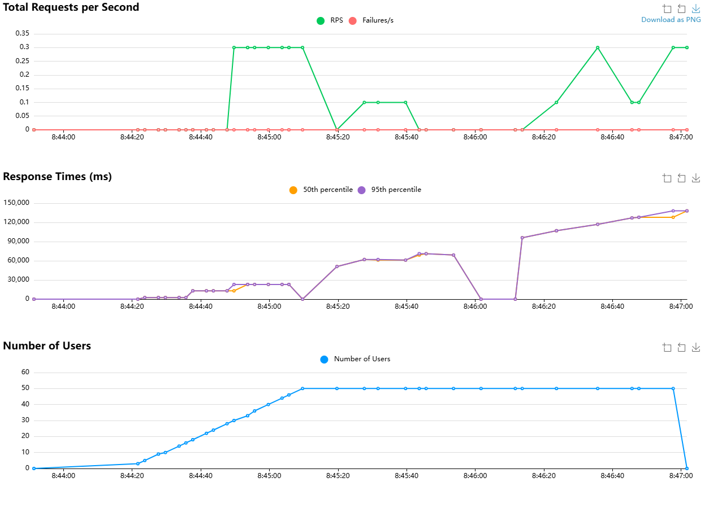
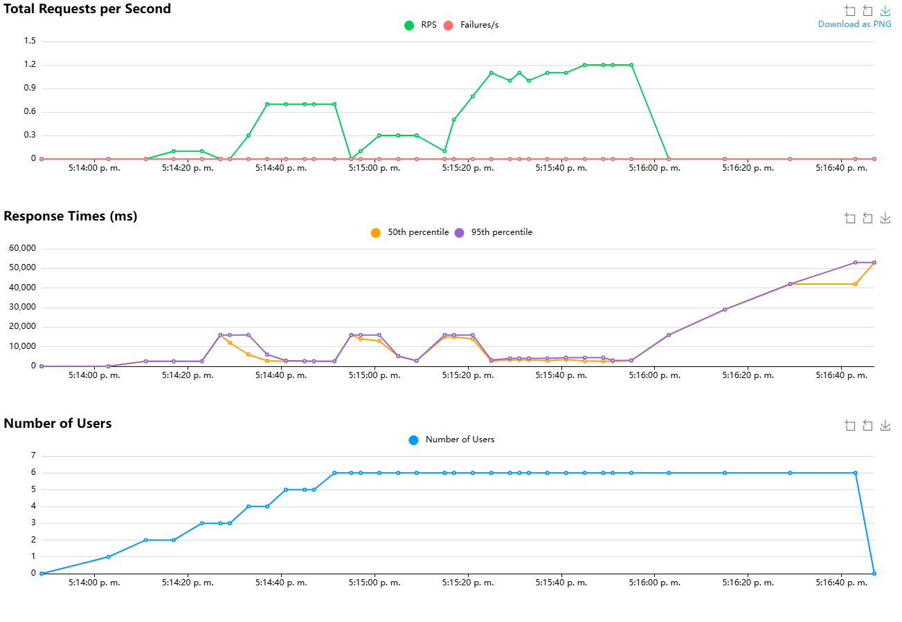

# Pruebas de Rendimiento - Biblioteca Digital

Este proyecto utiliza **Locust** para evaluar el rendimiento y la escalabilidad de los servicios de la Biblioteca Digital, simulando comportamientos de usuario real que incluyen registro, autenticación y navegación.

## Inicio Rápido

### 1. Inicia el API Gateway
```bash
cd ../api-gateway
php artisan serve
```

### 2. Ejecuta Locust con GUI
```bash
locust -f locust_laravel.py --host=http://127.0.0.1:8000
```

### 3. Abre el navegador
Ve a `http://127.0.0.1:8089` y configura:
- **Number of users**: Cantidad de usuarios simultáneos
- **Spawn rate**: Usuarios creados por segundo
- Luego presiona "Start swarming"

## Endpoints Probados

- Autenticación: `/api/register`, `/api/login`
- Libros: `/api/books`, `/api/books/{id}`, `/api/books` (POST), `/api/books/{id}` (PUT), `/api/books/{id}` (DELETE)
- Ventas: `/api/sales`
- Préstamos: `/api/loans`
- Multas: `/api/fines`
- Reportes: `/api/reports/dashboard`
- Perfil: `/api/me`


## Pruebas de carga

### Prueba Reciente

- **Número de usuarios**: 5
- **Tasa de generación (spawn rate)**: 0.1 usuarios por segundo
- **Duración**: 5 minutos

### Resultados



### Hallazgos y resultados de rendimiento

Tras realizar múltiples iteraciones de pruebas de carga, se han identificado los límites operativos actuales del sistema.

En la prueba final con una configuración de 5 usuarios concurrentes y un spawn rate de 0.1 u/s, se obtuvieron las siguientes conclusiones.

- El sistema mantiene una estabilidad óptima (tiempos de respuesta de ~3s) con hasta 3 usuarios simultáneos.
- Al alcanzar los 5 usuarios, el sistema presenta un comportamiento de "asfixia" o bloqueo secuencial. Los tiempos de respuesta (P95) escalan drásticamente hasta los **30 segundos**.
- Las gráficas de RPS muestran caídas a cero durante los picos de latencia, lo que indica que el servidor procesa las peticiones de forma síncrona y bloqueante, probablemente debido a consultas donde se relacionan entre sí los microservicios y la información que fluye entre ellos.

### Conclusiones Técnicas

- El sistema es funcional para entornos de muy baja demanda, pero no es escalable en su configuración actual.
- Cuello de Botella Detectado: El flujo de autenticación y registro actúa como un bloqueador de recursos, afectando la navegación general de los libros y reportes.


## Pruebas de estrés

### Prueba Reciente

- **Número de usuarios**: 50
- **Tasa de generación (spawn rate)**: 1 usuarios por segundo

### Resultados



### Hallazgos y resultados de rendimiento

Se realizó una prueba de estrés con 50 usuarios concurrentes y un spawn rate de 1 u/s. Los resultados fueron catastróficos para la disponibilidad del servicio

- El sistema colapsa de forma irreversible al superar los **15-20 usuarios** concurrentes.
- Los tiempos de respuesta alcanzaron un pico de **180 segundos**.

### Conclusiones Técnicas

- Viendo esta situación de que el sistema no es capaz de soportar al menos 15 usuarios se hace necesario implementar disntintas medidas sobre el código del aplicativo buscando que las peticiones y el flujo siga buenas prácticas y sea óptimo.
- Como el servidor tarda 3 minutos en responder, los 50 usuarios están esperando algo que en el mundo de la informática y la navegación web es inaceptable.


## Pruebas de capacidad

### Prueba Reciente

- **Número de usuarios**: 50
- **Tasa de generación (spawn rate)**: 1 usuarios por segundo

### Resultados



### Hallazgos y resultados de rendimiento

Se determinó la capacidad máxima del sistema mediante una rampa de 0.1 u/s hasta alcanzar los 6 usuarios.

- El sistema colapsa consistentemente al intentar procesar la carga del **6to usuario simultáneo**.
- Al superar el límite, las RPS caen a 0 y la latencia sube a 55s, lo que confirma que el servidor no tiene implementada una cola de espera eficiente.
- Con 5 usuarios los **Response Times** se mantuvieron relativamente bajos.

### Conclusiones Técnicas

- El sistema puede "coexistir" con 5-6 usuarios por periodos breves, pero está operando al 100% de su capacidad.
- El sistema muestra resilencia cuando tiene 6 usuarios estabilizandose por períodos de tiempo, pero mostrando **Response Times** más largos.
- Se conluye que con 5 usuarios el sistema es capaz de sobrevivir siendo éste el número de usuarios que es capaz de soportar.
